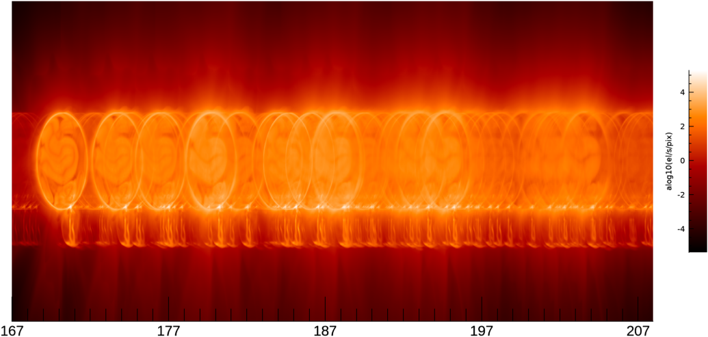

# overlappogram

Overlappogram is a Python package for inverting overlappogram observations of the Sun,
for examples MaGIXS, CubIXSS, or ECCCO observations.

# Install

`pip install overlappogram` or clone the repository and install manually

## How to Use

`overlappogram` comes with an executable main that you can run:

`unfold ./path/to/config.toml`

The `config.toml` file should be structured similar to the [example_config.toml](example_config.toml).

## Getting Help
Please [open an issue](https://github.com/jmbhughes/overlappogram/issues/new)
or [create a discussion](https://github.com/jmbhughes/overlappogram/discussions/new/choose).
We prefer this over email so that other users can benefit from your questions.

## Cite

## Contributors

The initial version of `overlappogram` was written by Dyana Beabout.
This version is written by [J. Marcus Hughes](https://github.com/jmbhughes).
